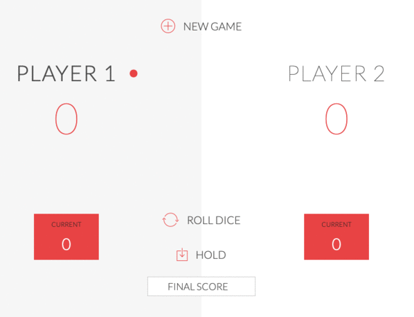

# Pig dice game


## Objective

Pig game is a simple dice game. The objective of the game is to score 100 points before the opponent do. The Pig game is played a two six-sided dies. 

## Gameplay

Each turn, a player repeatedly rolls a die until either a 1 is rolled or the player decided to "hold".

- Two standard dice are rolled. If neither shows a 1, their sum is added to the turn total.
- If a single 1 is rolled, the player scores nothing and the turn ends.
- If two 1s are rolled, the player’s entire score is lost, and the turn ends.
- If the player rolls any other number, it is added to their turn total and the player's turn continues.
- If a player chooses to "hold", their turn total is added to their score, and it becomes the next player's turn.

The first player to score 100 or more points wins.

For example, the first player, Anne, begins a turn with a roll of 3 and 5. Anne could hold and score 8 points, but chooses to roll again. Anne rolls a 2 and 2, and could hold with a turn total of 12 points, but chooses to roll again. Anne rolls a 1, and must end her turn without scoring. The next player, Bob, rolls the sequence 9-5-8-5, after which he chooses to hold, and adds his turn total of 27 points to his score.

## Game view

Screenshot of the game played:

<p align="center">
    
</p>


## Installation 

Step 1. Download/clone <a href="https://github.com/kplakosh/pig-game.git"> project file:

```
https://github.com/kplakosh/pig-game.git
```

Step 2. Open newIndex.html file in the browser and enjoy the game!
